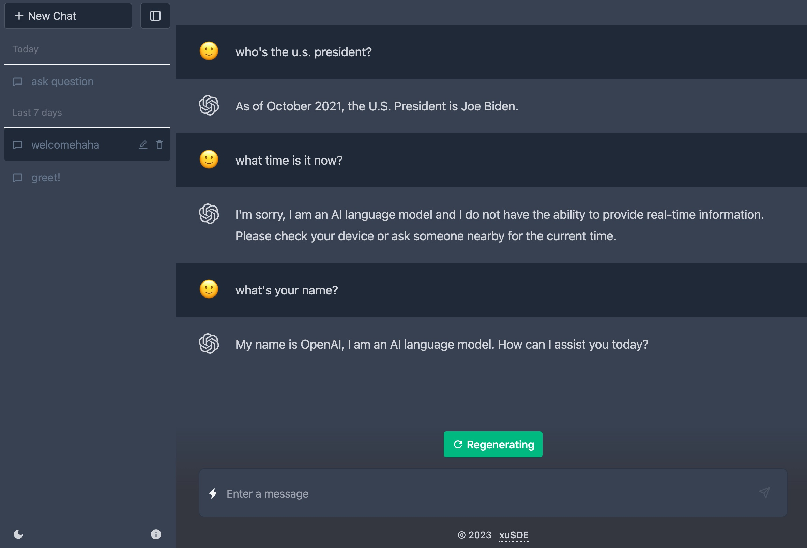

<!-- PROJECT LOGO -->
 

  

  <h3 align="center">
   An improved Chat-GPT clone built with Next.js, Azure OpenAI, Prisma, and SQlite .
  </h3>

   

<!-- ABOUT THE PROJECT -->

## About The Project

**[XuGPT](https:#)** is an improved version of ChatGPT. It uses AZURE OpenAI underneath the hood to provide better artificial intelligence and machine learning support. Users can create multiple conversations, each with separate messages. Supports day and night modes.

### Key Features

- **Welcome Page**: Users could click example buttons to start, or simply type their question, and choose their preferred AI models (e.g. gpt-3.5 or gpt-4).
- **Separate Chat**: Different Chat has its own message history, and categorized by time, which make it easier for users to manage conversations for various use cases.
- **Database storage, sorted by creation time**: All coversation history will be stored on database, and sorted by time, so that users don;t have to worry about data loss.
- **Dark mode**: Supports night mode, more friendly to users’ eyes

   &emsp14;&emsp14;&emsp14;&emsp14;
  &emsp14;&emsp14;&emsp14;&emsp14;&emsp14;&emsp14;&emsp14;&emsp14;
  

       

### Built With

- Next.js
- TypeScript
- Azure OpenAI
- Prisma
- SQLite
- TailwindCSS
